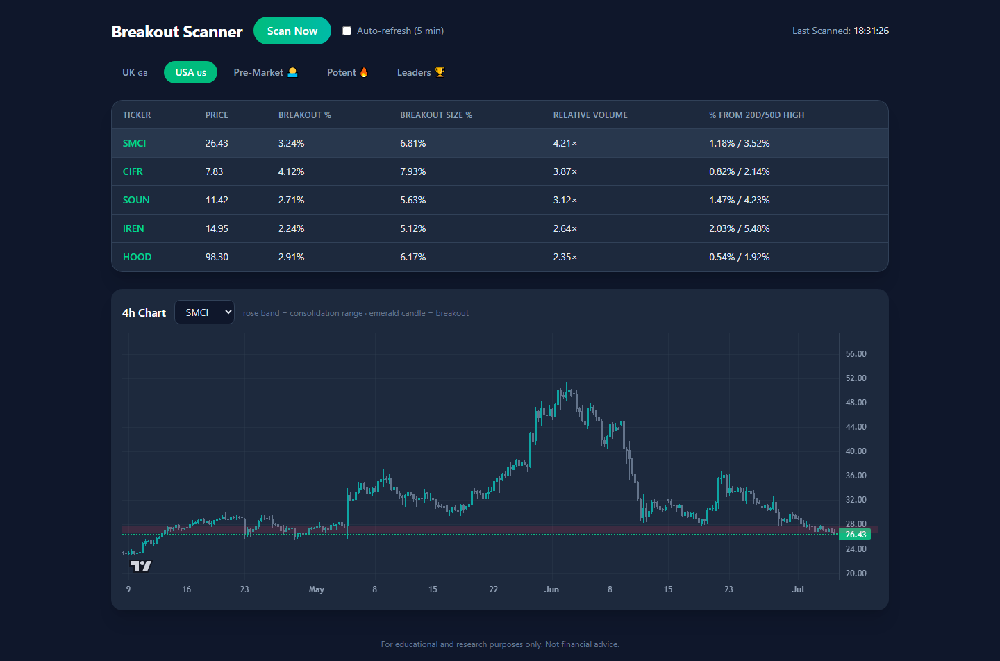

# Breakout Scanner

A full-stack stock screener that hunts for **4-hour consolidation breakouts** across the UK (FTSE All-Share core) and USA (S&P 500 + Nasdaq-100 + high-ADR momentum names), plus three momentum scanners for finding fast movers in hot sectors. Express + [yahoo-finance2](https://github.com/gadicc/node-yahoo-finance2) backend, React + Vite + Tailwind frontend with candlestick charts.

> **For educational and research purposes only. Not financial advice.**



*UI preview with sample table rows (`?demo=1`); the 4h chart, consolidation band, and breakout-candle highlight are live data.*

## Features

- **Breakout screen (UK 🇬🇧 / USA 🇺🇸)** — 8 checks on the most recently completed 4h candle: tight consolidation, 2%+ range break, 5%+ candle body, 1.5×+ relative volume, liquidity, market cap, proximity to highs, and trend alignment. Top 50 ranked by relative volume.
- **Pre-Market scanner 🌅** (US-only) — stocks gapping ≥ 4% pre-market on high-ADR names, for spotting episodic pivots before the open.
- **Potent scanner 🔥** — the previous session's strongest performers, for catching sector rotation and thematic momentum.
- **Leader scanner 🏆** — monthly performance ranking plus a **breadth count** (stocks up > 20%/month) as a market-health signal; a shrinking leadership list signals market weakness.
- **Momentum shortlisting** — all three scanners require ADR(20) > 5%, then shortlist stocks holding/reclaiming the 10/20/50 EMA inside a consolidation base, filtered by P/E < 20, volume > 2× the 20-day average, and RSI(14) > 50.
- **Intraday volume pacing ⚡** — during a live session the volume ratio is today's cumulative volume vs. the *expected* volume at this point in the session, so a real spike triggers mid-day instead of after the close.
- **Charts** — 4h candlesticks ([lightweight-charts](https://github.com/tradingview/lightweight-charts)) with the consolidation range shown as a translucent band and the breakout candle highlighted.
- Dark UI, manual **Scan Now** plus an optional 5-minute auto-refresh, per-market tabs.

## Quick start

Requires Node 18+.

```bash
# Backend (port 3001)
npm install
node server.js

# Frontend (port 5173, proxies /api → 3001) — separate terminal
cd frontend
npm install
npm run dev
```

Open http://localhost:5173, pick a tab, hit **Scan Now**. Add `?demo=1` to the URL to pre-fill the USA tab with sample rows (useful for UI work when the market isn't cooperating).

## API

All endpoints are POST with JSON bodies.

| Endpoint | Body | Returns |
|----------|------|---------|
| `/api/scan` | `{ "market": "uk" \| "usa" }` | Top 50 tickers passing all 8 breakout checks, sorted by relative volume |
| `/api/chart` | `{ "ticker": "AAPL" }` | Raw 4h candle array + consolidation range values |
| `/api/premarket` | `{ "relaxPE": bool }` | Pre-market gappers (US-only) |
| `/api/potent` | `{ "market", "relaxPE" }` | Previous session's strongest performers |
| `/api/leaders` | `{ "market", "relaxPE" }` | Monthly leaders + breadth count |

`relaxPE: true` (the "Include no-P/E stocks" toggle) lets stocks without earnings through the momentum filters — most high-ADR momentum names (crypto, quantum, space) have no P/E. A real P/E ≥ 20 still fails.

`/api/scan` also accepts `{ "tickers": ["AAPL", ...] }` to screen a custom list.

## The 8 breakout checks

Yahoo has no native 4h interval, so 1h candles are aggregated in groups of four (open = first, high = max, low = min, close = last, volume = sum; incomplete groups and the in-progress hourly bar are dropped).

1. **Consolidation** — over the prior 10 completed 4h candles, the body range (`max(open,close)` to `min(open,close)`) spans ≤ 12%
2. **Breakout** — current close ≥ 2% above the consolidation high
3. **Breakout size** — candle body ≥ 5%
4. **Relative volume** — ≥ 1.5× the prior 10-candle average
5. **Liquidity** — 20-day average daily volume ≥ 500k
6. **Market cap** — ≥ $50M
7. **Price level** — close within 10% of the 20-day or 50-day high
8. **Trend** — close above the 20-day and 50-day moving averages

Cheap checks (1–4) run first; daily data and market cap are only fetched for survivors.

## Notes & limitations

- Data comes from Yahoo Finance's unofficial API — it can throttle, lag, or change without notice. Requests are sent with a browser User-Agent, retried with backoff, capped at 8 concurrent, and responses are cached for 3 minutes.
- Ticker universes in [`tickers.js`](tickers.js) are curated snapshots and drift over time; failed symbols are skipped silently.
- UK tickers use the `.L` suffix and are priced in **pence (GBp)**.
- `yahoo-finance2` is pinned to **2.13.3** — see [`CLAUDE.md`](CLAUDE.md) for this and other gotchas.

## License

[MIT](LICENSE)
